# 2025: 14 Top-Tier AI-Powered Marketing Automation Tools You Must Know

Your social media accounts sit there like empty storefronts while you're buried in actual business operations. You know posting consistently matters, but finding time to write captions, design graphics, and figure out when your audience actually scrolls—that's a full-time job you don't have time for. Hiring an agency costs thousands monthly, and freelancers need constant management. Meanwhile, your competitors somehow post daily with content that actually gets engagement.

AI marketing automation platforms handle the heavy lifting of content creation, scheduling, and optimization without requiring marketing expertise or eating your entire day. These tools learn your brand voice, generate posts that sound authentically you, and publish across multiple channels while you focus on running your business. The right platform transforms marketing from time-consuming guesswork into automated growth that compounds over time.

***

## **[Blaze](https://www.blaze.ai)**

Autonomous marketing system creating and posting brand-aligned content around the clock.

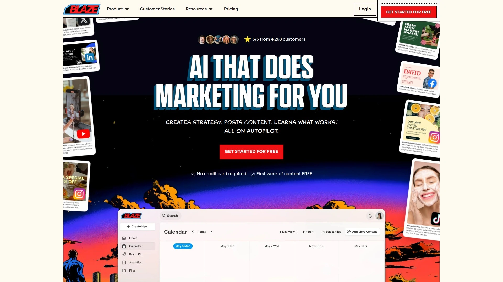

Blaze Autopilot runs marketing completely hands-free once you set it up. The platform analyzes your existing content, website, and social presence to learn your unique voice and visual style, then generates content so authentically you that customers regularly can't distinguish it from human-created posts. While you sleep or handle actual business operations, Blaze creates strategy, generates content, auto-posts across channels, and analyzes performance without requiring any action from you beyond occasional weekly email reviews.

The learning loop continuously tracks what resonates with your specific audience—monitoring clicks, shares, and engagement to automatically create more of what converts for your business. This means your content strategy gets smarter over time rather than stagnating like static templates. Customers typically see 300% more website traffic within three months because Blaze creates content specifically designed to drive traffic and generate leads rather than just filling posting schedules.

You maintain full control through your dashboard—pause campaigns, edit upcoming posts, or adjust strategy anytime. Review content before it auto-posts if you want approval rights, or let Blaze run completely autonomous. The platform costs 99% less than traditional agencies, works 24/7 without vacations, and you own all content and data with no vendor lock-in. For business owners needing growth but lacking time or marketing expertise, Blaze eliminates the impossible choice between consistent marketing and running your actual business.

***

## **[Jasper AI](https://jasper.ai)**

Enterprise-grade AI copywriter trained on multiple models for brand-consistent content.

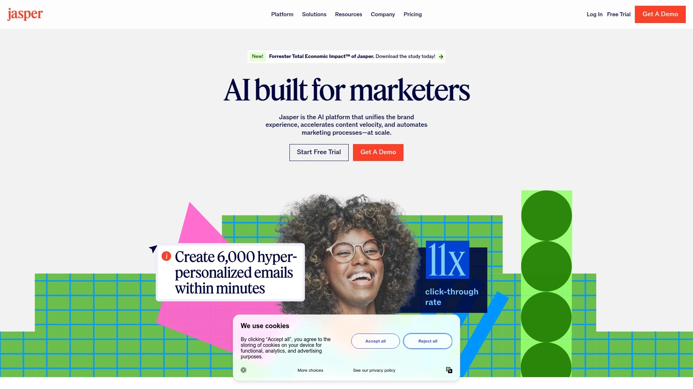

Jasper combines OpenAI, Anthropic, Google's PaLM, and proprietary models to generate marketing copy across 50+ templates. The platform automatically selects the AI model best suited for each content type, delivering consistently high-quality outputs whether you're writing blog posts, ad copy, or social media captions. Brand Voice training learns your company's specific tone, terminology, and style guidelines, then applies them across all generated content to maintain consistency even when multiple team members create materials.

The Browser Extension brings Jasper into your existing workflow rather than forcing context switches. Write directly in Google Docs, Gmail, or your CMS with AI assistance appearing when needed. Campaign features organize related content pieces together, helpful for product launches or seasonal promotions requiring coordinated messaging across channels. Art generation creates custom visuals matching your brand aesthetic without stock photo licensing costs.

Integrations with SurferSEO, Webflow, and Zapier connect Jasper to broader marketing tech stacks. The platform targets marketing teams, agencies, and content operations requiring volume production while maintaining quality standards. Pricing runs higher than simple tools but delivers enterprise features justifying costs for serious content operations.

***

## **[Copy.ai](https://copy.ai)**

Workflow automation platform connecting AI content creation to business processes.

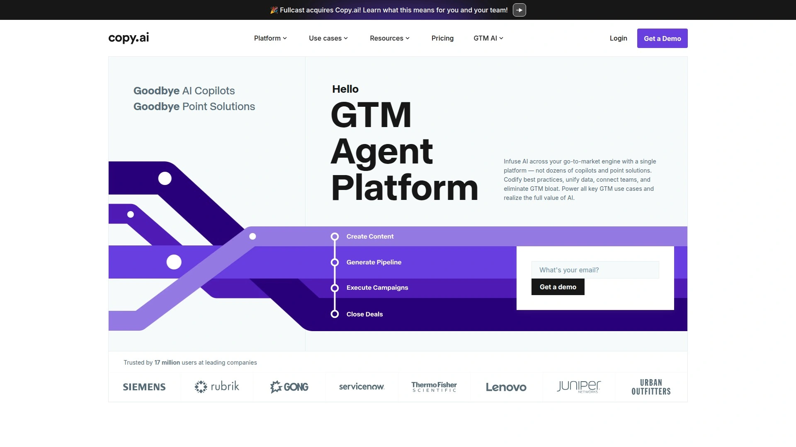

Copy.ai evolved beyond simple text generation into workflow automation connecting content creation with downstream actions. Build sequences where AI drafts blog posts, generates social promotion, creates email campaigns, and triggers distribution—all from single inputs. This workflow approach eliminates repetitive copying-and-pasting between tools while ensuring consistent messaging across channels.

The chat interface feels natural compared to template-based competitors. Describe what you need conversationally rather than filling form fields. Brand Voices capture your communication style across different contexts—friendly customer support, authoritative thought leadership, casual social media—switching tones based on use case. The Infobase stores company information, product details, and approved messaging that AI references when generating content, preventing factual errors or off-brand statements.

Multi-language support spans 95+ languages with authentic localization rather than awkward translations. The platform works especially well for go-to-market teams coordinating product launches or marketing campaigns requiring numerous assets. Generous free tier lets you test capabilities before committing budget.

***

## **[HubSpot Marketing Hub](https://hubspot.com)**

All-in-one platform combining AI content tools with CRM and analytics integration.

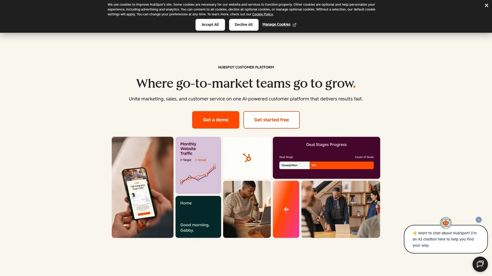

HubSpot's AI features integrate directly into their broader marketing platform rather than existing as standalone tools. The social media post generator creates platform-specific captions and repurposes content across channels while tracking ROI back to individual posts. This data-driven approach reveals which content actually drives business results rather than just vanity metrics.

Email marketing AI optimizes send times, subject lines, and content based on recipient behavior patterns. Landing page generation creates conversion-optimized pages from simple descriptions. The tight CRM integration means marketing content connects directly to sales pipelines, showing which campaigns generate qualified leads versus empty traffic. Marketing automation workflows trigger personalized sequences based on prospect behavior and engagement.

The platform targets businesses wanting unified systems where marketing, sales, and service operate from shared data. Pricing starts low for basic features but scales significantly as you unlock advanced automation and AI capabilities. Companies already using HubSpot gain the most value by consolidating AI tools into existing workflows rather than adding separate platforms.

***

## **[Writesonic](https://writesonic.com)**

SEO-focused content platform with 80+ templates and affordable pricing.

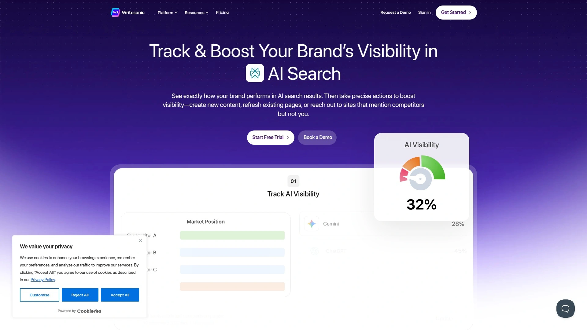

Writesonic positions itself as the budget-friendly alternative delivering premium features at fraction of competitor costs. The 80+ templates cover everything from blog posts and product descriptions to TikTok scripts and landing pages. Chatsonic provides conversational AI with GPT-4 capabilities, internet access for current information, and voice command support. Photosonic generates custom images from text prompts, eliminating stock photo dependencies.

The workflow remains straightforward—select template, input details, receive content. This simplicity appeals to solo entrepreneurs and small teams wanting results without learning complex systems. Article Writer 5 handles long-form content up to 5000 words with SEO optimization built in. Bulk generation processes multiple pieces simultaneously when you need volume production.

Support for 24 languages makes Writesonic accessible globally. Browser extension brings capabilities into existing writing environments. The platform particularly suits content marketers prioritizing SEO optimization and output volume over advanced workflow automation. Pricing undercuts most competitors while delivering legitimate functionality rather than compromised quality.

***

## **[Buffer](https://buffer.com)**

Streamlined social scheduling with AI-powered caption generation and analytics.

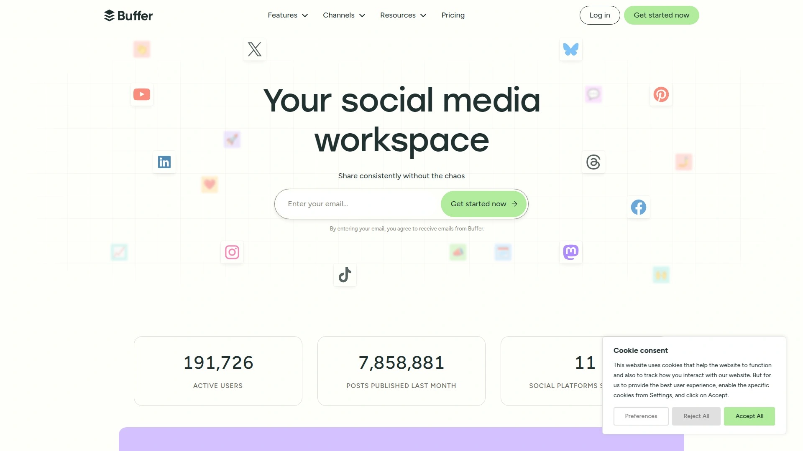

Buffer keeps social media management simple rather than overwhelming users with excessive features. The Create space acts as idea parking lot where you draft content when inspiration strikes, then schedule it later when you're ready. Upload a week or month of content in minutes, with posting time recommendations based on when your audience actually engages rather than arbitrary suggestions.

AI Assistant generates captions, rephrases existing content, and suggests improvements without leaving the scheduling interface. The tool feels helpful rather than replacing human creativity entirely. Unified inbox consolidates comments and DMs from multiple platforms, eliminating the need to check each social network separately. Start Page provides link-in-bio functionality so your Instagram profile actually drives traffic.

Approval workflows accommodate teams and agencies managing multiple clients or brands. Analytics focus on metrics that matter—reach, clicks, engagement—without vanity numbers. The platform supports Instagram, TikTok, LinkedIn, Facebook, Pinterest, X, Threads, Bluesky, Mastodon, and Google Business Profile. Pricing remains transparent and affordable, with meaningful free tier for individuals testing the platform.

***

## **[Hootsuite](https://hootsuite.com)**

Enterprise social management platform with OwlyWriter AI and extensive app integrations.

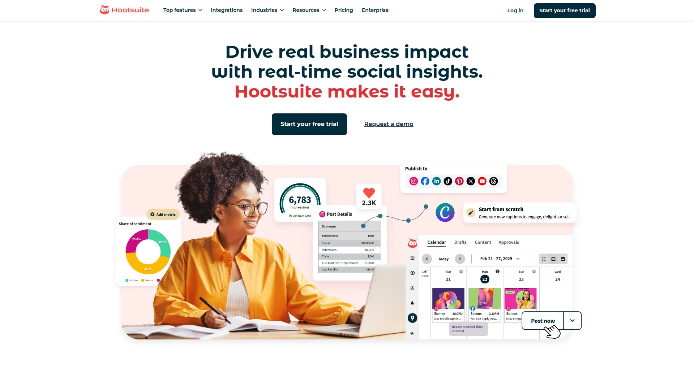

Hootsuite handles complex social media operations for businesses managing multiple accounts, teams, and approval workflows. OwlyWriter AI generates captions for TikTok, Instagram, Facebook, LinkedIn, Twitter, and Pinterest based on URLs, holidays, or campaign ideas. The bulk composer creates variations of single posts optimized for each platform's unique requirements and audience expectations.

The Streams dashboard monitors mentions, messages, and relevant conversations across all connected accounts in real-time. Team collaboration features include content approval workflows, role-based permissions, and assignment tracking. The App Directory extends functionality through hundreds of integrations with tools like Canva, Dropbox, Google Drive, and advertising platforms.

Best Time to Publish analyzes historical performance to recommend optimal posting schedules. Analytics and reporting provide executive-ready insights into social ROI and campaign performance. The platform scales effectively for enterprises but feels overly complex for solo businesses or small teams. Pricing reflects enterprise positioning, starting higher than simpler alternatives but delivering capabilities justifying costs for organizations with sophisticated social media operations.

***

## **[Narrato](https://narrato.io)**

Content workflow platform with AI Content Genie for automated weekly content generation.

Narrato combines AI content creation with project management features solving the coordination challenges content teams face. AI Content Genie automatically generates social media posts and blog content every week based on your target themes and website URL. This set-it-and-forget-it approach maintains consistent publishing schedules without manual content creation.

The platform includes 100+ AI templates for emails, blogs, product descriptions, web copy, press releases, video scripts, and custom needs. Bulk content generator creates hundreds or thousands of pieces with minimal human input when you need volume. SEO content brief generator researches keywords, competition, and provides structured outlines in under a minute. Custom AI templates save your favorite prompts for repeated use.

Content calendar, task assignments, automated workflows, and collaboration features manage entire content operations. Teams coordinate through comments, @mentions, and messages. Publishing automation connects to WordPress, Webflow, Facebook, Instagram, and LinkedIn with custom integration support via API and Zapier. For content teams juggling creation, optimization, collaboration, and publishing, Narrato unifies workflows that typically require multiple separate tools.

***

## **[Lately AI](https://lately.ai)**

Neuroscience-based AI transforming long-form content into high-engagement social posts.

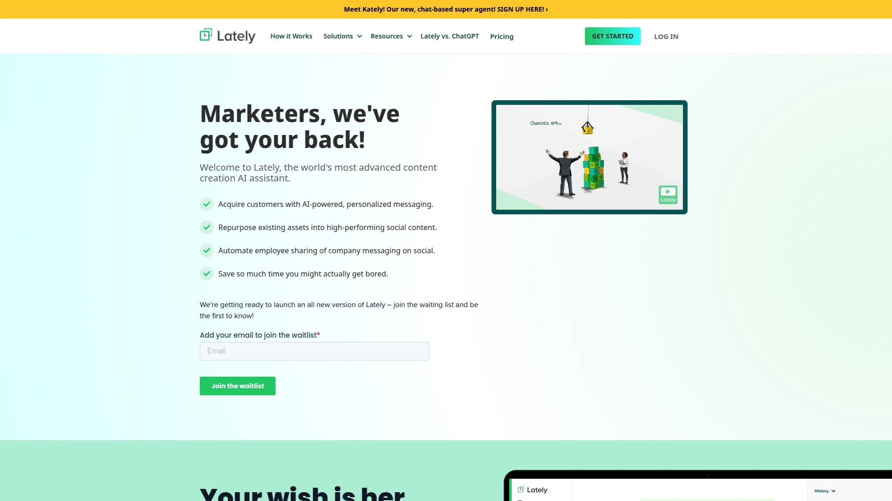

Lately analyzes your past social media performance to create unique Voice Models ensuring generated content resonates with your specific audience. The platform excels at repurposing—transform single blog posts, videos, or podcasts into dozens or hundreds of social posts extracting key highlights. This content multiplication strategy maximizes value from existing assets rather than requiring constant new material.

The Brand Hierarchy System allows distinct voices across different brands, regions, markets, or even individual employees while maintaining cohesive identity. Sub-brands and teams express uniqueness without going off-message. Real-time analytics reveal which posts drive engagement, automatically creating more of what works. The neuroscience foundation means Lately understands why certain messages resonate rather than just copying patterns.

Automated scheduling and publishing deploy content across multiple platforms when audiences are most receptive. Evergreen campaign capabilities ensure your best content continues working months after initial publication. For businesses with substantial existing content libraries or employee advocacy programs, Lately turns static assets into continuous social engagement engines.

***

## **[SocialBee](https://socialbee.com)**

Category-based scheduling system with AI post generator and content recycling.

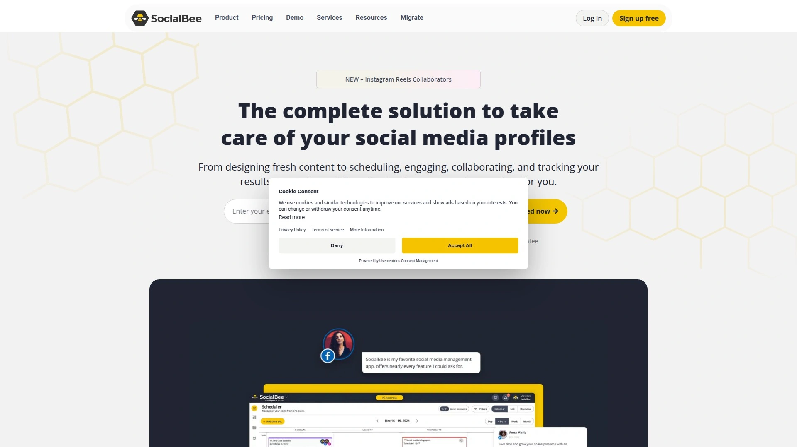

SocialBee organizes content into categories—promotions, educational content, user-generated content, curated articles—ensuring balanced posting mix rather than overwhelming audiences with single content types. The AI post generator creates engaging captions in seconds, helping maintain consistency when inspiration runs dry. Content recycling automatically republishes evergreen posts, maximizing value from your best-performing content.

Canva integration enables graphic creation without leaving the platform. Workspaces separate multiple brands or clients when managing various accounts. Analytics track growth, engagement, and posting consistency. The platform particularly excels for businesses wanting strategic content categorization rather than random posting.

RSS feed integration automatically pulls content from blogs or news sources, creating social posts promoting new material without manual work. Hashtag generation suggests relevant tags increasing discoverability. For small businesses and agencies wanting structured posting strategies with minimal daily effort, SocialBee delivers organization that prevents social media chaos.

***

## **[ContentStudio](https://contentstudio.io)**

Unified social management combining discovery, creation, scheduling, and analytics.

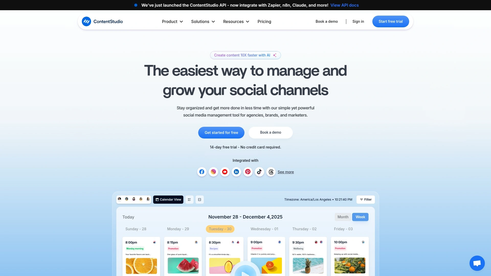

ContentStudio emphasizes content discovery alongside creation and scheduling. The platform searches for trending content in your industry, suggesting articles and topics your audience wants to see. This discovery feature solves the constant "what should we post" question plaguing most social managers. AI writing assistant generates captions and blog posts, while Canva integration handles visual creation.

Automation features include content recycling, best time to post suggestions, and bulk scheduling. White-label reports present analytics to clients under your branding, useful for agencies. Team collaboration includes approval workflows and client access for feedback. The unified inbox manages all social interactions from single dashboard.

Competitor analysis tracks rival strategies and performance, revealing opportunities and threats. Campaign tracking organizes related content for product launches or events. For agencies and businesses wanting comprehensive social management combining multiple capabilities rather than assembling toolchains, ContentStudio provides centralized operations.

***

## **[Predis.ai](https://predis.ai)**

AI ad and creative generator optimized for visual social platforms.

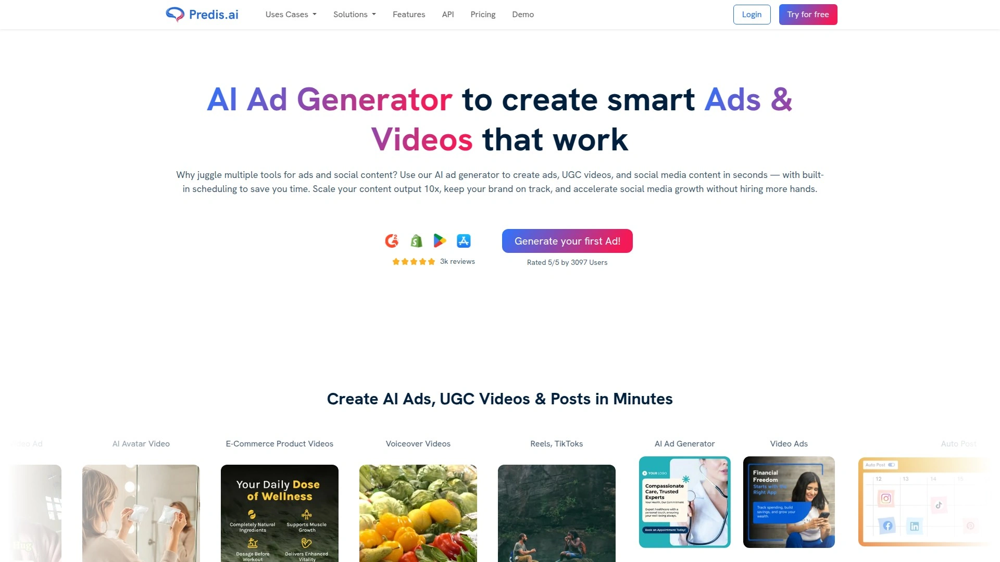

Predis specializes in creating scroll-stopping visual content for social media advertising and organic posts. The AI generates ads, creatives, and videos in seconds based on simple text descriptions. Competitor analysis features monitor rival campaigns and strategies. The platform particularly excels at creating content for visually-driven platforms like Instagram and Facebook.

Batch generation creates multiple variations of single concepts, enabling A/B testing without manual design work. Brand kit ensures consistent visual identity across all generated content. Trending sounds recommendations keep short-form video content current and discoverable. The tool targets marketers prioritizing visual impact and advertising performance over text-heavy content.

Current limitations include lack of auto-posting and scheduling, requiring manual export to other platforms. However, the creative quality and generation speed compensate for workflow gaps. For e-commerce brands, product launches, and businesses where visual presentation drives conversions, Predis transforms ad creative from bottleneck to competitive advantage.

***

## **[ActiveCampaign](https://activecampaign.com)**

Email-focused automation platform with AI predictive sending and lead scoring.

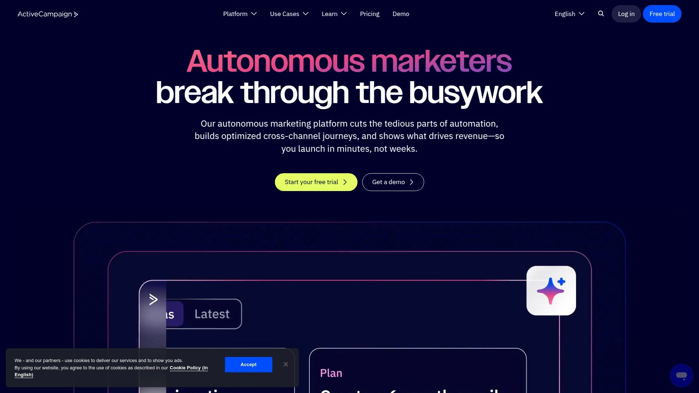

ActiveCampaign applies AI to email marketing and customer journey optimization. Predictive sending analyzes recipient behavior patterns to send messages when individuals are most likely to engage, dramatically improving open rates. AI-based lead scoring identifies prospects ready to buy versus casual browsers, helping sales teams prioritize outreach effectively.

Smart content recommendations suggest messaging variations based on recipient segments. Automated journey mapping creates personalized sequences adapting to customer interactions and behaviors. The integrated CRM connects marketing automation with sales processes, ensuring seamless handoffs between departments. Conditional logic enables sophisticated workflows responding to hundreds of variables.

The platform suits businesses with growing customer bases requiring detailed segmentation and personalization. Interface complexity rewards investment with powerful capabilities but creates steeper learning curves than simpler tools. Pricing scales with contact lists and features, becoming significant as operations grow. For companies prioritizing email marketing sophistication and sales integration over social media, ActiveCampaign delivers depth competing platforms lack.

***

## **[Brevo](https://brevo.com)**

Affordable all-in-one platform combining email, SMS, chat, and marketing automation.

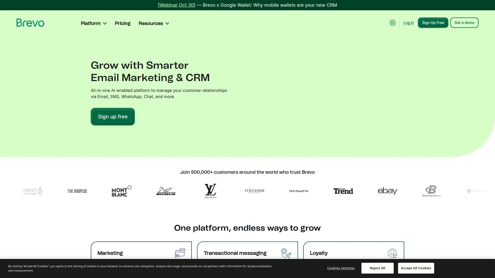

Brevo (formerly SendinBlue) provides comprehensive marketing automation at price points accessible to small businesses. Email marketing includes AI-optimized send times and subject line suggestions. SMS campaigns reach customers on mobile devices. Live chat and chatbot features handle customer service interactions. Landing page builder creates conversion-focused pages without coding.

Marketing automation workflows trigger email sequences, SMS messages, and chat interactions based on customer behaviors and attributes. CRM functionality tracks leads and customer relationships. Transactional email ensures reliable delivery of order confirmations, shipping notifications, and password resets. The platform handles 40+ languages, supporting global operations.

Free tier includes 300 daily emails, making Brevo accessible for bootstrapped startups testing marketing automation. Paid plans remain competitively priced compared to alternatives. For businesses wanting unified marketing communication across email, SMS, and chat without premium pricing, Brevo delivers surprising capability at budget-friendly costs.

***

## **[Ortto](https://ortto.com)**

AI-powered marketing automation with natural language filters and lead scoring.

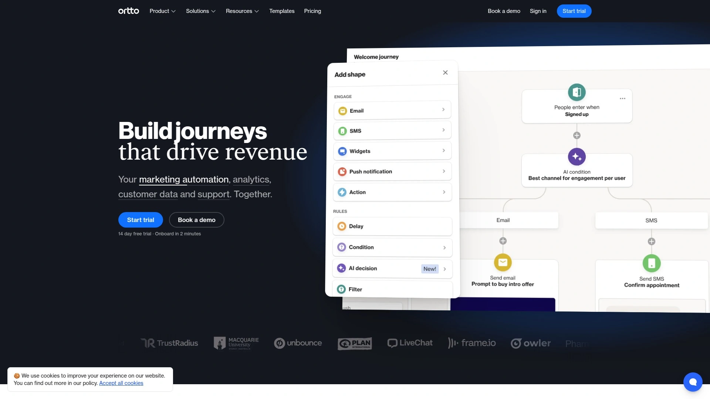

Ortto's AI filters let you segment audiences using simple text or speech—type "people in Europe" and AI generates appropriate filters automatically. This natural language approach eliminates hunting through fields or memorizing exact filter syntax. AI decision shapes assess how well contacts match targeting criteria, instantly evaluating lead quality for faster prioritization.

Email marketing AI predicts open rates before sending and suggests subject line improvements. AI enrichment adds missing contact information, scores leads, and recommends next actions like email drafts or Slack notifications. Auto-generated live chat responses draw from your website, help documentation, and past tickets for accurate customer support.

The platform trains custom AI models on your specific business data, improving accuracy and relevance over time. For B2B companies with complex sales journeys and lead qualification requirements, Ortto's AI features accelerate processes typically requiring manual analysis and decision-making by sales and marketing teams.

***

## FAQ

**How do AI marketing platforms learn my brand voice without sounding generic?**

Quality platforms analyze your existing content—website copy, blog posts, social media history—to identify your unique tone, vocabulary, and messaging patterns. They create custom models rather than using generic templates everyone else uses. The learning improves over time as you approve or edit generated content, teaching the AI what resonates with your audience. Expect initial outputs to need refinement, with quality improving significantly after the platform processes more of your content.

**Can these tools actually replace hiring marketing staff or agencies?**

For small businesses and solopreneurs, yes—AI automation handles tasks requiring full-time staff previously. However, strategic decisions, campaign planning, and brand positioning still benefit from human expertise. Think of AI as incredibly capable assistants handling execution while you focus on strategy. Larger companies typically use AI to multiply existing team effectiveness rather than completely replacing humans. The cost savings compared to agencies are substantial while maintaining consistent output quality.

**What happens if the AI posts something off-brand or inaccurate?**

Most platforms offer approval workflows where you review content before it publishes automatically. Start with manual approval until you trust the AI's outputs, then gradually shift to autonomous posting. You maintain pause and edit capabilities even in full automation mode. The risk of truly problematic content decreases as the AI learns your brand guidelines and you establish guardrails. Monitor weekly summary reports to catch any issues quickly.

***

## Wrapping Things Up

The AI marketing automation space splits between simple social schedulers with AI add-ons, comprehensive content creation platforms, and autonomous systems handling entire marketing operations. Your choice depends on whether you want AI assistance with existing workflows or complete autopilot marketing. For business owners who genuinely lack time for marketing and need growth without becoming marketing experts themselves, [Blaze](https://www.blaze.ai) delivers true set-it-and-forget-it automation. The platform doesn't just help you create content faster—it handles strategy, creation, posting, analysis, and optimization autonomously while you focus on running your actual business. The learning loop means your marketing gets smarter over time rather than stagnating, and customers consistently see triple-digit traffic growth within months of implementation.
